# System Architecture Analysis

## Overview

- **Project**: /home/tom/github/pyfunc/typermd
- **Primary Language**: python
- **Languages**: python: 9, shell: 1
- **Analysis Mode**: static
- **Total Functions**: 61
- **Total Classes**: 5
- **Modules**: 10
- **Entry Points**: 50

## Architecture by Module

### src.typermd.renderer
- **Functions**: 24
- **Classes**: 2
- **File**: `renderer.py`

### src.typermd.logger
- **Functions**: 12
- **Classes**: 1
- **File**: `logger.py`

### src.typermd.themes
- **Functions**: 7
- **Classes**: 1
- **File**: `themes.py`

### src.typermd.help
- **Functions**: 6
- **Classes**: 1
- **File**: `help.py`

### src.typermd
- **Functions**: 5
- **File**: `__init__.py`

### examples.basic
- **Functions**: 3
- **File**: `basic.py`

### examples.tables_panels
- **Functions**: 2
- **File**: `tables_panels.py`

### examples.table_styles_demo
- **Functions**: 1
- **File**: `table_styles_demo.py`

### examples.logger_usage
- **Functions**: 1
- **File**: `logger_usage.py`

## Key Entry Points

Main execution flows into the system:

### src.typermd.renderer._make_highlighters
> Build language-specific highlighter rules.
- **Calls**: _HL, _HL, _HL, _HL, _HL, _HL, _HL, _HL

### src.typermd.renderer.MarkdownRenderer.render
> Render a complete markdown document.
- **Calls**: text.split, len, None.startswith, line.strip, re.match, re.match, re.match, re.match

### src.typermd.renderer.MarkdownRenderer._inline
> Apply inline markdown formatting.
- **Calls**: re.sub, re.sub, re.sub, re.sub, re.sub, re.sub, re.sub, re.sub

### examples.logger_usage.deploy
> Simulate a deployment with structured logging.
- **Calls**: app.command, typer.Option, typer.Option, log.info, log.step, log.step, log.step, log.action

### src.typermd.renderer.MarkdownRenderer.heading
- **Calls**: self._wln, self._wln, min, self._c, min, self._wln, self._c, len

### src.typermd.renderer.MarkdownRenderer.codeblock
- **Calls**: self._c, self._wln, highlighted.split, self._wln, src.typermd.renderer._highlight_code, self._wln, self._c, self._c

### src.typermd.echo
> Enhanced echo that auto-detects and renders markdown.

Drop-in replacement for ``typer.echo()`` with one extra feature:
if the message looks like mark
- **Calls**: str, src.typermd.renderer.looks_like_markdown, src.typermd.renderer.render_markdown, _original_echo, None.write, text.endswith, hasattr

### src.typermd.help.install_help_formatter
> Install the markdown help formatter on a Typer app.

This patches the underlying Click group's format_help to use
MarkdownHelpFormatter.

Args:
    ap
- **Calls**: hasattr, hasattr, MarkdownHelpFormatter, None.format_help, formatter.write, md_formatter.getvalue, super

### src.typermd.help.MarkdownHelpFormatter._colorize
> Apply inline markdown rendering to help text.
- **Calls**: re.sub, re.sub, re.sub, m.group, m.group, m.group

### examples.basic.hello
> Say hello with markdown formatting.
- **Calls**: app.command, typer.Option, typer.Option, typer.md, typer.md

### src.typermd.renderer.MarkdownRenderer.blockquote
- **Calls**: text.split, self._wln, self._c, self._c

### src.typermd.renderer.MarkdownRenderer.checklist_item
- **Calls**: self._wln, self._c, self._c, self._inline

### src.typermd.renderer.render_to_string
> Render markdown and return as string.
- **Calls**: StringIO, src.typermd.renderer.render_markdown, buf.getvalue, src.typermd.renderer._supports_color

### examples.table_styles_demo.demo
> Demonstrate all table styles.
- **Calls**: app.command, typer.md, typer.table

### examples.tables_panels.deps
> Show project dependencies as a table.
- **Calls**: app.command, typer.md, src.typermd.table

### src.typermd.logger.Logger._emit
- **Calls**: self._c, self._c, self.stream.write

### src.typermd.renderer.MarkdownRenderer.horizontal_rule
- **Calls**: self._wln, self._c, min

### src.typermd.renderer.MarkdownRenderer.list_item
- **Calls**: self._c, self._wln, self._inline

### src.typermd.renderer.MarkdownRenderer.numbered_item
- **Calls**: self._c, self._wln, self._inline

### src.typermd.help.MarkdownHelpFormatter.__init__
- **Calls**: None.__init__, src.typermd.renderer._supports_color, super

### src.typermd.help.MarkdownHelpFormatter.write
> Override write to apply markdown formatting.
- **Calls**: None.write, self._colorize, super

### src.typermd.help.MarkdownHelpFormatter.write_heading
> Write a heading with color.
- **Calls**: self.write, None.write_heading, super

### examples.basic.status
> Show system status with styled output.
- **Calls**: app.command, typer.md

### examples.basic.demo
> Demonstrate all markdown features.
- **Calls**: app.command, typer.md

### src.typermd.blockquote
> Render a blockquote.
- **Calls**: None.blockquote, src.typermd.renderer.get_renderer

### src.typermd.themes.list_themes
> Return list of available theme names.
- **Calls**: list, _THEMES.keys

### src.typermd.themes.init_theme_from_env
> Initialize theme from TYPERMD_THEME env variable.
- **Calls**: os.environ.get, src.typermd.themes.set_theme

### examples.tables_panels.info
> Show app info in a panel.
- **Calls**: app.command, src.typermd.panel

### src.typermd.logger.Logger.action
> Log an action step.
- **Calls**: self._c, self.stream.write

### src.typermd.logger.Logger.step
> Log a numbered step.
- **Calls**: self._c, self.stream.write

## Process Flows

Key execution flows identified:

### Flow 1: _make_highlighters
```
_make_highlighters [src.typermd.renderer]
```

### Flow 2: render
```
render [src.typermd.renderer.MarkdownRenderer]
```

### Flow 3: _inline
```
_inline [src.typermd.renderer.MarkdownRenderer]
```

### Flow 4: deploy
```
deploy [examples.logger_usage]
```

### Flow 5: heading
```
heading [src.typermd.renderer.MarkdownRenderer]
```

### Flow 6: codeblock
```
codeblock [src.typermd.renderer.MarkdownRenderer]
  └─ →> _highlight_code
```

### Flow 7: echo
```
echo [src.typermd]
  └─ →> looks_like_markdown
  └─ →> render_markdown
      └─> get_renderer
```

### Flow 8: install_help_formatter
```
install_help_formatter [src.typermd.help]
```

### Flow 9: _colorize
```
_colorize [src.typermd.help.MarkdownHelpFormatter]
```

### Flow 10: hello
```
hello [examples.basic]
```

## Key Classes

### src.typermd.renderer.MarkdownRenderer
> Renders markdown text to the terminal with ANSI colors.
- **Methods**: 15
- **Key Methods**: src.typermd.renderer.MarkdownRenderer.__init__, src.typermd.renderer.MarkdownRenderer.width, src.typermd.renderer.MarkdownRenderer._w, src.typermd.renderer.MarkdownRenderer._wln, src.typermd.renderer.MarkdownRenderer._c, src.typermd.renderer.MarkdownRenderer.heading, src.typermd.renderer.MarkdownRenderer.codeblock, src.typermd.renderer.MarkdownRenderer.blockquote, src.typermd.renderer.MarkdownRenderer.horizontal_rule, src.typermd.renderer.MarkdownRenderer.list_item

### src.typermd.logger.Logger
> Markdown-aware structured logger.

All output is emitted as styled text to the specified stream.
- **Methods**: 10
- **Key Methods**: src.typermd.logger.Logger.__init__, src.typermd.logger.Logger._c, src.typermd.logger.Logger._emit, src.typermd.logger.Logger.debug, src.typermd.logger.Logger.info, src.typermd.logger.Logger.success, src.typermd.logger.Logger.warning, src.typermd.logger.Logger.error, src.typermd.logger.Logger.action, src.typermd.logger.Logger.step

### src.typermd.help.MarkdownHelpFormatter
> Click HelpFormatter that renders markdown in help text.
- **Methods**: 5
- **Key Methods**: src.typermd.help.MarkdownHelpFormatter.__init__, src.typermd.help.MarkdownHelpFormatter._colorize, src.typermd.help.MarkdownHelpFormatter.write, src.typermd.help.MarkdownHelpFormatter.write_heading, src.typermd.help.MarkdownHelpFormatter.write_usage
- **Inherits**: click.HelpFormatter

### src.typermd.themes.Theme
> Color theme definition with named color slots.
- **Methods**: 1
- **Key Methods**: src.typermd.themes.Theme.get_color

### src.typermd.renderer._HL
> Highlighter rule: pattern + color.
- **Methods**: 0

## Data Transformation Functions

Key functions that process and transform data:

### src.typermd.help.install_help_formatter
> Install the markdown help formatter on a Typer app.

This patches the underlying Click group's forma
- **Output to**: hasattr, hasattr, MarkdownHelpFormatter, None.format_help, formatter.write

## Public API Surface

Functions exposed as public API (no underscore prefix):

- `src.typermd.table` - 50 calls
- `src.typermd.renderer.MarkdownRenderer.render` - 45 calls
- `src.typermd.panel` - 19 calls
- `examples.logger_usage.deploy` - 12 calls
- `src.typermd.renderer.MarkdownRenderer.heading` - 12 calls
- `src.typermd.renderer.MarkdownRenderer.codeblock` - 10 calls
- `src.typermd.echo` - 7 calls
- `src.typermd.help.install_help_formatter` - 7 calls
- `examples.basic.hello` - 5 calls
- `src.typermd.renderer.MarkdownRenderer.blockquote` - 4 calls
- `src.typermd.renderer.MarkdownRenderer.checklist_item` - 4 calls
- `src.typermd.renderer.render_to_string` - 4 calls
- `examples.table_styles_demo.demo` - 3 calls
- `src.typermd.themes.set_theme` - 3 calls
- `examples.tables_panels.deps` - 3 calls
- `src.typermd.renderer.looks_like_markdown` - 3 calls
- `src.typermd.renderer.MarkdownRenderer.horizontal_rule` - 3 calls
- `src.typermd.renderer.MarkdownRenderer.list_item` - 3 calls
- `src.typermd.renderer.MarkdownRenderer.numbered_item` - 3 calls
- `src.typermd.help.MarkdownHelpFormatter.write` - 3 calls
- `src.typermd.help.MarkdownHelpFormatter.write_heading` - 3 calls
- `examples.basic.status` - 2 calls
- `examples.basic.demo` - 2 calls
- `src.typermd.blockquote` - 2 calls
- `src.typermd.themes.list_themes` - 2 calls
- `src.typermd.themes.init_theme_from_env` - 2 calls
- `examples.tables_panels.info` - 2 calls
- `src.typermd.logger.Logger.action` - 2 calls
- `src.typermd.logger.Logger.step` - 2 calls
- `src.typermd.renderer.MarkdownRenderer.paragraph` - 2 calls
- `src.typermd.renderer.render_markdown` - 2 calls
- `src.typermd.help.MarkdownHelpFormatter.write_usage` - 2 calls
- `src.typermd.themes.Theme.get_color` - 1 calls
- `src.typermd.themes.get_theme` - 1 calls
- `src.typermd.logger.Logger.debug` - 1 calls
- `src.typermd.logger.Logger.info` - 1 calls
- `src.typermd.logger.Logger.success` - 1 calls
- `src.typermd.logger.Logger.warning` - 1 calls
- `src.typermd.logger.Logger.error` - 1 calls
- `src.typermd.logger.get_logger` - 1 calls

## System Interactions

How components interact:

```mermaid
graph TD
    _make_highlighters --> _HL
    render --> split
    render --> len
    render --> startswith
    render --> strip
    render --> match
    _inline --> sub
    deploy --> command
    deploy --> Option
    deploy --> info
    deploy --> step
    heading --> _wln
    heading --> min
    heading --> _c
    codeblock --> _c
    codeblock --> _wln
    codeblock --> split
    codeblock --> _highlight_code
    echo --> str
    echo --> looks_like_markdown
    echo --> render_markdown
    echo --> _original_echo
    echo --> write
    install_help_formatt --> hasattr
    install_help_formatt --> MarkdownHelpFormatte
    install_help_formatt --> format_help
    install_help_formatt --> write
    _colorize --> sub
    _colorize --> group
    hello --> command
```



## Reverse Engineering Guidelines

1. **Entry Points**: Start analysis from the entry points listed above
2. **Core Logic**: Focus on classes with many methods
3. **Data Flow**: Follow data transformation functions
4. **Process Flows**: Use the flow diagrams for execution paths
5. **API Surface**: Public API functions reveal the interface

## Context for LLM

Maintain the identified architectural patterns and public API surface when suggesting changes.